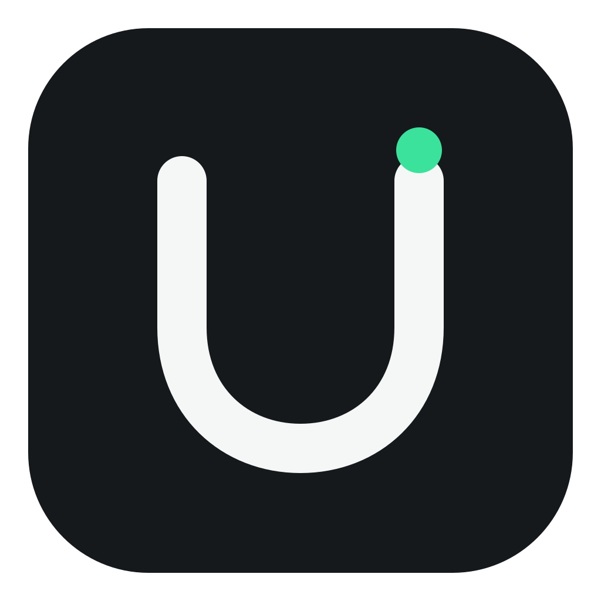

<p align="center">
  
</p>

<h1 align="center">uNotch</h1>

<p align="center">
  Live AI usage, quietly tucked into the edge of your Mac.
</p>

<p align="center">
  <a href="https://github.com/SethMed7/unotch/releases/latest"><strong>Download for Apple silicon</strong></a>
  · <a href="https://sethmed7.github.io/unotch/">Website</a>
  · macOS 14+
  · Native Swift
  · MIT
</p>

<p align="center">
  <a href="https://github.com/SethMed7/unotch/actions/workflows/ci.yml"></a>
  <a href="LICENSE"></a>
  <a href="https://github.com/SethMed7/unotch/releases/latest"></a>
</p>

uNotch is a lightweight menu bar utility for Claude, Codex, and Cursor Agent.
Its nearly hidden edge cue expands into a glass usage HUD when you hover — no
dashboard window and no Dock icon.

## What it monitors

| Provider | Local source | Usage shown |
| --- | --- | --- |
| Claude | Claude Code CLI `/usage` | 5-hour and weekly limits |
| Codex | Codex app-server rate limits | Available plan windows |
| Cursor | Cursor Agent CLI `/usage` | Monthly included usage |

All usage is read from command-line tools already authenticated on your Mac.
uNotch does not ask for, copy, or store provider credentials.

## Install

1. [Download the latest DMG](https://github.com/SethMed7/unotch/releases/latest).
2. Open it and drag **uNotch** into **Applications**.
3. Launch uNotch from Applications. Its mark appears in the menu bar.

The release app and DMG are Developer ID signed, Apple notarized, and stapled.
The installer supports Apple silicon Macs running macOS 14 Sonoma or newer.

## Use

- Move the pointer to the subtle cue at the screen edge and hold for 150 ms to
  reveal the HUD.
- Hover a provider logo to switch providers and refresh stale usage.
- Use the refresh control for an immediate read from the selected local CLI.
- Drag the rail vertically or across the display to place it on either edge.
- Hover near the **bottom** of the HUD to reveal the settings gear. It opens a
  small section with everything uNotch can be told:
  - **Side** — dock to the left or right edge.
  - **Position** — a drag handle to move the HUD anywhere along the edge.
  - **Update & Restart** — fetch the latest signed release and relaunch.
  - **Quit**.
- The menu bar item offers the same refresh, edge, update, and quit actions.

The saved edge and vertical position are restored on the next launch.

## Privacy by design

- No analytics, telemetry, advertising, or crash-reporting SDKs.
- No uNotch account, cloud service, incoming server, or listening port.
- CLI output is parsed in memory and is not logged or written to disk.
- Raw CLI errors are discarded so account identifiers and local paths are not
  exposed in the interface.
- Only the screen edge and vertical position are stored in macOS preferences.
- The only network request uNotch ever makes is the one you trigger with
  **Update & Restart**; it talks to GitHub Releases and nothing else.

Provider CLIs still use their own network connections, authentication stores,
and caches. See [PRIVACY.md](PRIVACY.md) for the complete data flow and
[SECURITY.md](SECURITY.md) for trust boundaries, the update verification steps,
and how to report a vulnerability.

## Requirements

- macOS 14 or newer
- Apple silicon for the downloadable DMG
- At least one supported local CLI: `claude`, `codex`, or Cursor's `agent`

Missing or signed-out CLIs are shown as unavailable without affecting the other
providers.

## Build from source

The Swift package has no third-party package dependencies.

```sh
swift test
swift run uNotch
```

Create a local release DMG:

```sh
./scripts/build-dmg.sh
```

For a notarized distribution build, provide a Developer ID identity and a
`notarytool` profile stored in Keychain. Never put their real values in the
repository.

```sh
APPLE_SIGNING_IDENTITY="Developer ID Application: …" \
NOTARY_PROFILE="your-keychain-profile" \
./scripts/build-dmg.sh
```

The script signs the app with hardened runtime, optionally notarizes and
staples it, creates the DMG, then signs and optionally notarizes and staples the
installer.

## Verify a download

Download `SHA256SUMS` from the same release, then run (substituting the file
name of the DMG you downloaded):

```sh
shasum -a 256 -c SHA256SUMS
xcrun stapler validate uNotch-<version>-arm64.dmg
spctl --assess --type open --context context:primary-signature --verbose=2 \
  uNotch-<version>-arm64.dmg
```

`spctl` should report `accepted` with a notarized Developer ID source.

## Project layout

```text
Sources/uNotch/        AppKit windowing, SwiftUI UI, state, CLI readers, updater
Tests/uNotchTests/     Parser, state, hover geometry, updater, and render checks
brand/                 Brand canon: BRAND.md, tokens, logo variants
site/                  The single-page website (GitHub Pages)
Resources/             macOS bundle metadata
scripts/               Icon generation and signed DMG packaging
DESIGN.md              Generated design system (Stitch format) for AI agents
```

## Contributing

Issues and pull requests are welcome. Read [CONTRIBUTING.md](CONTRIBUTING.md)
first — it covers the scope uNotch keeps deliberately small, how to run the
tests, and the review flow. `main` is protected: changes land through reviewed
pull requests with CI passing.

## Security

Please do not disclose a suspected vulnerability in a public issue. Use
[GitHub's private vulnerability report](https://github.com/SethMed7/unotch/security/advisories/new)
so it can be investigated before publication.

## License

[MIT](LICENSE) © 2026 Seth Medina. Claude, Codex, ChatGPT, and Cursor are
trademarks of their respective owners; uNotch is an independent project and is
not affiliated with Anthropic, OpenAI, or Anysphere.
